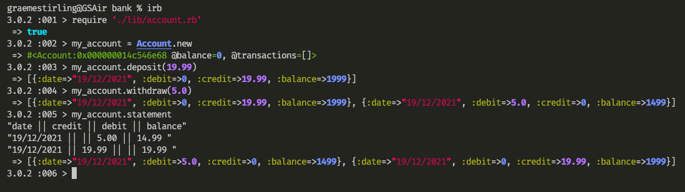

# Description

This tech task allows a user to create a bank accounts and make actions on those accounts. Such as withdrawals, deposits and printing transaction statements.

## Specification

### Requirements

* You should be able to interact with your code via a REPL like IRB or the JavaScript console.  (You don't need to implement a command line interface that takes input from STDIN.)
* Deposits, withdrawal.
* Account statement (date, amount, balance) printing.
* Data can be kept in memory (it doesn't need to be stored to a database or anything).

### Acceptance criteria

**Given** a client makes a deposit of 1000 on 10-01-2012  
**And** a deposit of 2000 on 13-01-2012  
**And** a withdrawal of 500 on 14-01-2012  
**When** she prints her bank statement  
**Then** she would see

```
date || credit || debit || balance
14/01/2012 || || 500.00 || 2500.00
13/01/2012 || 2000.00 || || 3000.00
10/01/2012 || 1000.00 || || 1000.00
```

## Planing 

### Domain model 

For this task I felt two classes would be sufficient. An account class for the user to intract with and a statement class to deal with the formating/printing of account transactions. I used the below domain model as my starting point.   


### User Stories

As a user  
So that I can store my money in one place  
I would like to be able to create a bank account.

As a user  
So that I can store my money   
I would like to be able to deposit into my bank account.

As a user  
So that I can have access to my money  
I would like to be able to withdraw from my bank account.

As a user  
So that I can monitor my transactions  
I'd like to be able to print a dated bank statement.



### Technologies used 
Ruby (model) <br>
RSpec (testing) 

## Installation instructions 

To use this program you will need a version of Ruby installed

Clone this repo: 

```git clone {https://github.com/gjstirling/Bank-Tech-test.git}```

Install gems by running: 

```bundle install```

## Usage instructions 

First activate a REPL by entering the following into the command line inside the project directory: 
```irb```

Import the account class: 
```require './lib/account.rb'```

User can create a new bank account:
``` my_account = Account.new ```

User can deposit:
```my_account.deposit(10.0)```

Withdraw: 
```my_account.withdraw(5.0)``` 

print statement:
```my_account.statement``` 

## Feature test

To run the feature test enter the below command while in the root directory 
```ruby './feature_test.rb'```

## testing/linting

To run the unit tests 
```rspec```

To check linting 
```rubocop```


